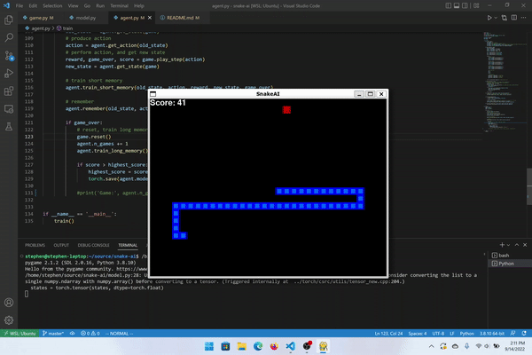

# SnakeAI

Teaching a Reinforcement Learning Agent to play Snake with Deep Q Learning.

### Neural Net

The neural net is an MLP with an input layer of 11 neurons, a hidden layer of 256 neurons, and an output layer of 3 neurons.

### Vision / State

Each step taken throughout the game, the state of the environment is assessed. 

In this assessment, the agent keeps track of:

- Whether there is:
    - Danger straight ahead (Danger =  about to hit border or itself)
    - Danger to the right
    - Danger to the left
- Whether its current direction of movement is:
    - To the left
    - To the right
    - To the top
    - To the bottom
- Whether the location of the apple is:
    - To the left
    - To the right
    - To the top
    - To the bottom

From this assessment of the state, the agent then computes the next course of action as output: whether to go straight, take a right, or take a left. (3 outputs)

### Deep Q Learning

Each step taken throughout the game, the agent performs a particular action, and gets the state of the environment.

Using the knowledge of the current state and the previous state (state before taking action), the neural net undergoes a single training step where it outputs Q-values (values that represent the largest expected reward achievable for each action taken, given a state) and compares these values with Q-values computed using something called the Bellman-Optimality Equation. 

This comparison gives us a loss, which we can then use to minimize through backpropogation and gradient descent. 

So, this training will, in effect, make the neural net good at computing Q-values for each action, given a state, which is good because the agent can just take the action with the highest Q-value, which lets it progress through the game.

This process will repeat for each step through the game, until the game is over, and once the game is over the neural net will be trained on a batch of previous states and next states to make it even better at computing Q-values the next game around.

Eventually, the agent will learn to play Snake!

